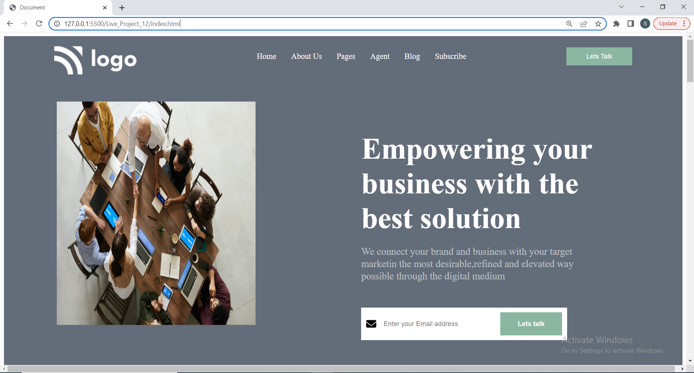
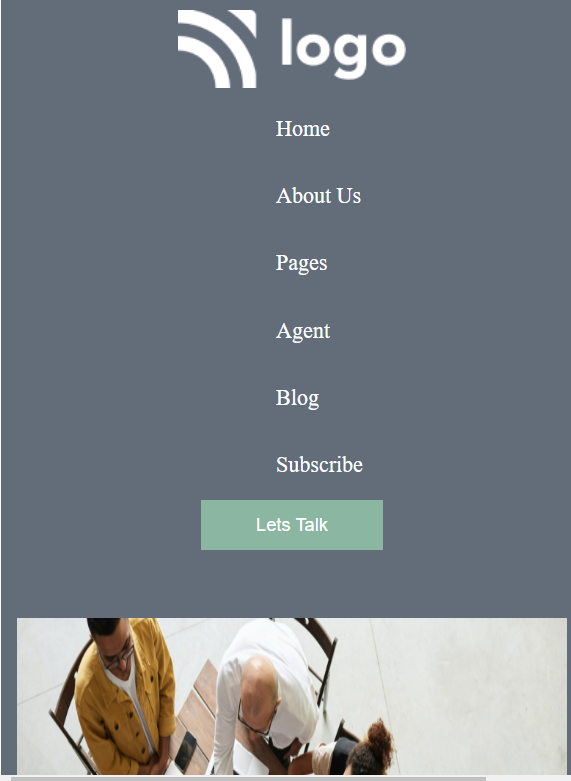

# Marketing Company website []

This is basically a full blown website made in HTML/CSS for an imaginary website developeming and hosting company like wix on the internet. 
Hope you like my project !! it works good in laptop screen if you are using desktop please zoom in or out that might work .

## Technologies Used
  - HTML - Hyper Text Markup Language
  - CSS - Cascadeing Spread Sheet
  - CSS Flex box

## Demo
### Laptop View


### Mobile Screen View



Clone the project

```bash
  git clone https://github.com/suhas-sm/Marketing-company-website.git
```

Go to the project directory

```bash
  cd Marketing-company-website
```
## Features

- Transition Scroll Effect
- Modern Typical webpage design
- UI/UX Design
- Full Blown Website
- Mobile Responsive

## What i have learnt By working on this project
1. I have improved my self in positioning of images in a spesific position, also using flex properties
2. Improved in designing the project
3. Making it responsivness in better way
4. Got a good understanding on createing big one pager website

## Honest Time to finish the project

I had took about 3 hours. This project made me understand how to make an image positioned with respect to other and also using flex properties.

## Feedback

If you have any feedback, please reach out to us at melmurissm11@gmail.com
